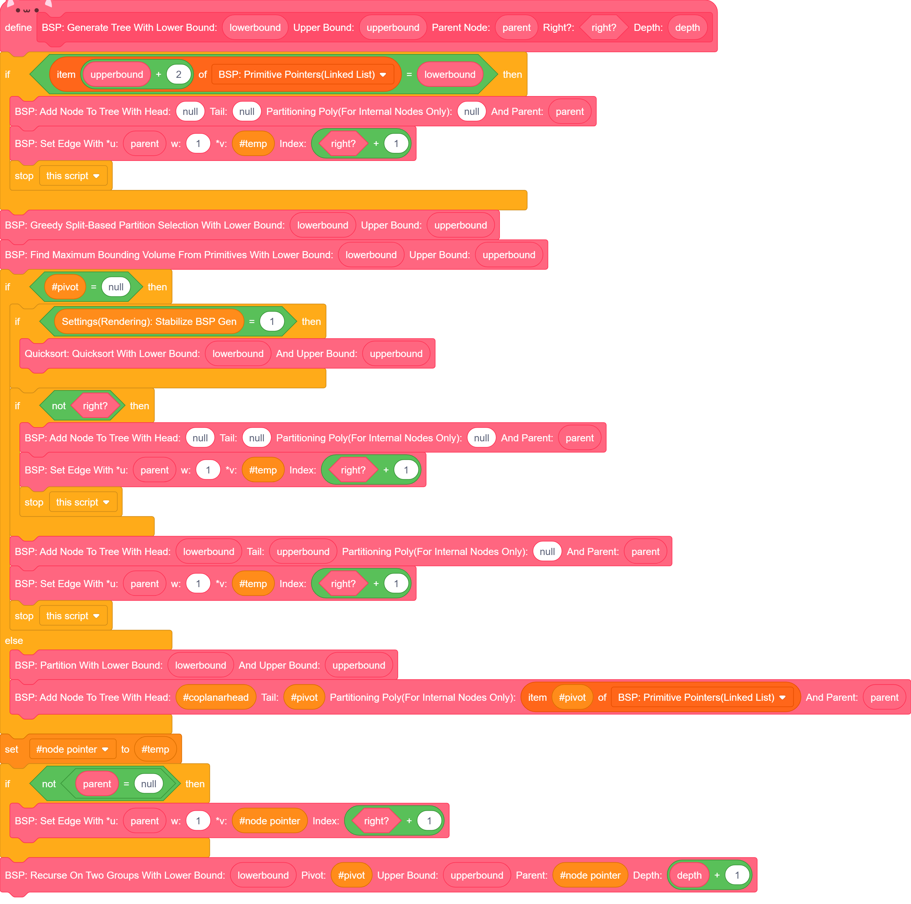

+++
title = "Gamma Engine BSP Code Translated"
description = "A C translation of the BSP tree generation function which I wrote for the Gamma Engine project."
date = 2024-12-09
[taxonomies]
tags=["scratch", "c", "pseudocode"]
+++

(9 Dec 2024) This is still in progress! I just wrote this page so there may be errors until the afternoon!

(10 Dec 2024) Added C code. Might have errors that I haven't fixed yet...

Here is the BSP tree generation code for Gamma Engine. It creates a solid-leaf BSP tree, given a set of polygons from a lazy mesh. I originally wrote this in Scratch, but wanted to make a more understandable translation in pseudocode. After writing a quick pseudocode, and realizing it would actually be useful(and more fun!) to outright write it in C, I decided to just simply make the entire function along with its structure defs in C language. I decided to keep the pseudocode anyways since it was an important step I used to translate the Scratch code into C. The C/pseudocode is provided below the scratch blocks.


<div class="figure2">
    
</div>

This was the translated pseudocode I threw together overnight. It's full of problems and might not be very helpful to read, but I'm keeping it because it did help me write the C code in the snippet further below this one.

```txt
function bsp_gen(lower, upper, side, parent)
    IF upper.next = lower THEN
        add_node(null, null, null, side, parent) //adds a solid leaf
        return
    greedy_select_pivot(lower, upper)
    gen_bounding_geometry(lower, upper)
    IF pivot = null THEN
        stabilize_sort(lower, upper)
        IF not right? THEN
            add_node(null, null, null, side, parent)
            return
        add set to air leaf, inherit parent
        add_node(lower, upper, null, side, parent) //add air leaf
    ELSE
        partition(lower, upper)
        IF parent = null THEN
            add_node(partitionhead, pivot, &pivot, null, parent) //adds an internal node 
        ELSE
            add_node(partitionhead, pivot, &pivot, side, parent)
        bsp_gen(lower, pivot, left, *newnode)
        bsp_gen(lower.next, upper, right, *newnode)
```

... And I wrote the C translation, starting with all of the typedefs specific to the program:

```h,linenos
typedef struct plane_s
{
    vec3_t              normal, point;
    struct plane_s      *hash_chain;
} plane_t;

typedef struct ptnplane_s {
    int                 planenum;
    int                 tested;	
    struct ptnplane_s   
} ptnplane_t;

typedef struct face_s {
    struct face_s       *next;
    winding_t           *w;
    int                 planenum;
    int                 numverts;
    ptnplane_t          *original
} face_t;

typedef struct node_s {
    //leaves and internal nodes
    int                 planenum;           // -1 = leaf node
    struct node_s       *parent;
    vec3_t              minb, maxb;<br>
    //nodes only
    ptnplane_t          *ptnplane;
    struct node_s       *children[2];
    //leaves only
    face_t              *facelist;
} node_t;
```

(I did not include the any of the more general typedefs such as <code>vec3_t</code> and <code>winding_t</code>, but you would need them in order to describe the geometric primitives)

... And then the definitions of <code>bspgen</code>:


```c,linenos
node_t *bspgen(node_t *node, face_t *faces) {
    node_t              *newnode;
    ptnplane_t          *pivot;<br>

    pivot = greedyselect(faces);
    if (!pivot) {
        //We add a leaf
        node->side = NULL;
        node->planenum = -1;
        node->facelist = faces;
        return node;
    }

    node->ptnplane = pivot;
    node->planenum = pivot->planenum & ~1;  // From Quake II. It's more cumbersome in Scratch
    
    newnode = AllocNode();
    newnode->parent = node;
    node->children[1] = newnode;
    newnode = AllocNode();
    newnode->parent = node;
    node->children[2] = newnode;

    SplitFaces(node->planenum);
}
```

Much of the code is quite akin to that of the BSP tool in the idTech 2 lineage. 

<!-- ptnplane_s *greedyselect() {
    int                 val, bestval;
    ptnplane_t          *current, *pivot;
} -->