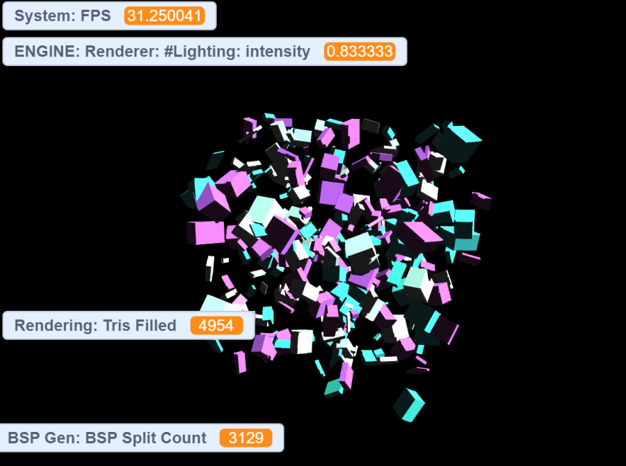
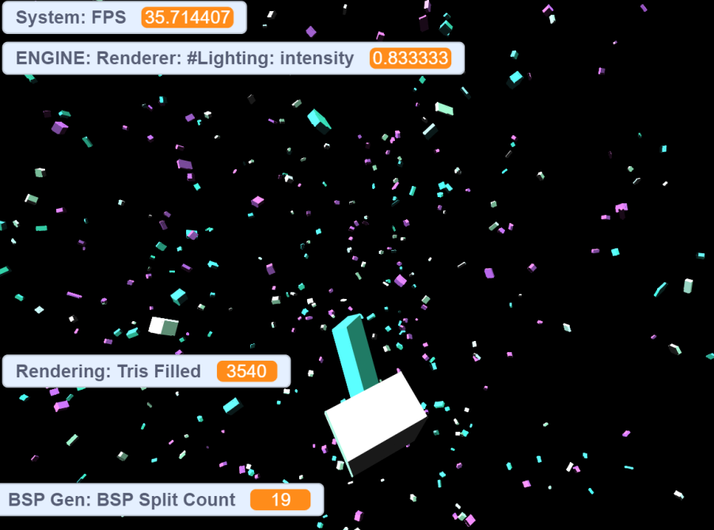
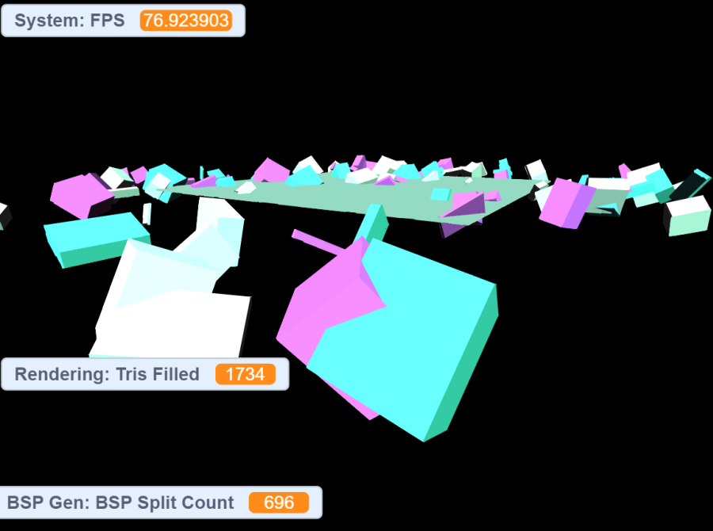
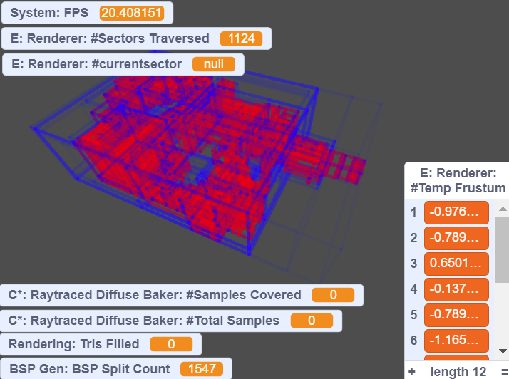

+++
title = "GAMMA ENGINE" 
description = "Inspired by the id Tech 2 (Quake) engine, built in the Scratch language from the ground-up."
date = 2024-12-22
[extra]
start_date = "31 OCT 2022"
end_date = "01 JAN 2025"
status = "COMPLETE"
icon = "/projects/2022-gammaengine/2024-10-05.png"
+++

<h1 class="article-title">GAMMA ENGINE</h1>

    <b>An engine inspired by id Tech 2 (Quake), which I programmed entirely from the ground-up. Here are some of the following which I wrote for it:</b>
    <li>Tool which converts lazy meshes of .OBJ format into solid-leaf BSP trees</li>
    <li>Another which bakes map lighting by pathtracing on the solid-leaf trees</li>
    <li>An alternative light baker which uses radiosity-based methods</li>
    <li>Traversal, search, and insertion functions</li>
    <li>Player movement and collision engine</li>
    <li>Various trace and collision functions</li>
    <li>Quaternion, as well as matrix-based vector transformation libraries</li>
    <li>3D dynamic sound engine</li>
    <li>Dynamic solid models</li>
    <li>Particle engine</li>
    <li>Real-time lighting engine</li>

<iframe src="blockout_radiant.html" style="display:block;height:47.5vw;width:60vw;margin-left:auto;margin-right:auto;border:none;">
</iframe>

<h2>WEB DEMO INSTRUCTIONS:</h2>

<b>To run the project, click the green flag. You can move the camera with the mouse. Press ESC to disable pointer lock. You can move the player around the level with WASD controls. Use space to jump. The project is somewhat resource-heavy, so you can stop it by pressing the stop, or alternatively pause, icon on the upper left of the project. There also exists a button to enable fullscreen.</b>

I've been working on this one for a while now. It's a 3D game engine inspired by the id Tech 2 (Quake) engine. I built it in the year 2022. Like all my engines from around then, it was built in the Scratch language from the ground-up. It includes a tool which converts lazy meshes in .OBJ format into solid-leaf BSP trees, and another, which subsequently bakes map lighting by pathtracing on the generated BSP trees. Core functions of the engine include various trace functions against the BSP tree, as well as traversal, search, and insertion. It allows for features such as Quake-style player movement, projectiles that bounce, and a mesh of an enemy which occludes properly against the game map. These features are built in their own respective engines: The movement engine, entity updates engine, and the rendering engine.

It uses a 3D dynamic sound engine I wrote for a previous project to produce directional audio. Transformations are either done using some simple matrix operations, or through a handful of quaternion functions, and I get to choose between the two when I need to code a transformation. Currently, triangles are filled using a "fast triangle fill", which uses Scratch's pen tool to fill a triangle in as little strokes and calculation as possible. The sound engine, quaternion functions, and triangle filler were written previous to the development of this project, and for previous projects.

    

        
    

    
        <b>A map I made for the engine called "blockout". Shadows can be preprocessed and rendered as overlaid polygons.</b>
    

<h1 class="article-title">ALPHA, BETA, AND GAMMA</h1>

Gamma Engine started as a vision to create a 3D engine suitable for creating fun first person shooter type games on Scratch. It had to have rich functionality like never seen before. Within a few months of on-and-off programming, I had something working. It had a wireframe neon guy who could blast bullets in first person. I also wrote a sound module which allowed for sounds to play directionally for the player. The sound would fall-off at a distance. This was what I now call "Alpha Engine".

    

        
        
        
    

    
        <b>During winter break of 2020, my friends and I tested and played the engine in its current state.</b>
    

Although it was quite a personal success, it was hard to use and ran extremely slow. I kept updating and building this engine until 2022. By then, it reached its own limits. As per my learning process, I wanted to conquer one of the three at a time: Functionality, user-friendliness, and optimization. Immediately after stopping development on the project, I wanted to make a more user-friendly engine... and I made Beta Engine.

    

        
    

    
        <b>One of the many experiments I did with BETA.</b>
    

It was the COVID-19 pandemic. I would frequently scrolling and conversing in online circles, both on Scratch and not not on Scratch, with other users who coded technical Scratch-based programs. Users I knew of would occasionally bring up this algorithm, purported to have to ability to eliminate all rendering artifacts otherwise encountered by the common-use "painter's algo" which they called Binary Space Partitioning. I had been told it was used extensively in the 1993 DOOM, and many other 3D games around that time, as an essential means of optimization. 

I knew nothing more about it, but after thinking a bit, I was able to reverse-engineer an algorithm from conceptual-level description. The new algorithm would take an array of polygons in 3D camera space (stored as pointers to polygon objects), and used [Lomuto's Partitioning Scheme](https://en.wikipedia.org/wiki/Quicksort#Algorithm) to sort them. The partition pivots were defined as the planes in which a polygon lied upon. All other polygons within the given set would be partitioned by whether they lay within the front of, or behind, the partitioning plane. Polygons existing within both half-spaces were split along the plane and their fragments were inserted in each of their respective half-spaces. The front of the partitioning plane would be dictated by which half-space the viewing camera was located. The sort would be recursed upon the two half spaces until there no longer existed unused pivot polygons. 

The implementation was initially buggy due to my limited understanding of how computer scientists would approach such a problem. In fact, I remember using strings of ones and zeros to feed into a helper function in order to drive the algorithm. It was not an ideal method. I later ran into a sole existing implementation of exactly what I wanted to implement. That implementation which I ended up basing my algorithm off of was much closer to the essence of Lomuto's Partitioning Scheme, which is employed as a common quicksort algorithm. [Quicksort can be conceptualized as a space-optimized form of a binary tree sort](https://en.wikipedia.org/wiki/Quicksort#Relation_to_other_algorithms), where the tree is implied as opposed to explicit.

As the year turned to 2020, I had a nicely working engine which, in every given frame, could be fed a polygon soup. It would in turn properly sort all of the geometry, splitting any offending polygons, and return an artifact-free image of the scene. I quickly figured that with the clipping and chopping helper functions I wrote which could take any arbitrary plane and chop a scene, I could create interesting effects which involved subtractions against the world geometry.

Some things that I tried making were visual "portals", magnifying lenses, x-ray lenses, and hologram lenses.

    

        
    

    
        <b>A hologram sight I made for the engine demo project.</b>
    

    

        
    

    
        <b>An example of what I would call the "x-ray effect".</b>
    

<h1 class="article-title">GAMMA: ENGINE OF LIGHT</h1>

I wanted functionality and I wanted user-friendliness. And I felt I achieved them. I wanted optimization. So I sought for it. 
I started looking into the use of [binary tree walks to render polygon meshes](https://dl.acm.org/doi/pdf/10.1145/965105.807481/). This was my first real dive into the data structures of computer science. Instead of executing a sort on the scene at every frame like the predecessor engine, GAMMA would take any given polygonal mesh and partition it, sequentially storing pivot polygons in tree nodes and pushing partitioned sets into the children. The children would be recursed on until there are no longer unused polygons. This canonical method of "Autopartitioning" created a binary space partitioning tree or "BSP Tree" for short. The method now known as an implementation of BSP was called such due to the fact that research preceding Fuch's 1980 paper dealt with the idea of depth coherence, which states that a polygon on the far side of the plane cannot, in any way, obstruct a closer polygon. I previously alluded to this idea when describing Beta Engine's rendering technique. The preceding strategy involved strategically positioned planes, which were manually placed by a scene designer. Autopartitioning extended this idea and algorithmically allowed the process to be fully automated. To render the scene, the tree is walked in-order at run-time. This would generate the frames in GAMMA. The traversal would run in a linear, or O(n), time complexity, as opposed to the common painter algorithm's log-linear complexity.

    

        
        
        
    

    
        <b>In November 2022, I had a working rendering system for the engine. Its speed wonderfully exceeded my expectations as my friends and I performed various stress tests on the renderer. I was well convinced that I was working with something of great potential.</b>
    

    

        
    

    
        <b>In the course of a few months, I created a lighting tool which used random light bounces to simulate global illumination. It relied on an octree as an acceleration structure, which was something I would later replace with the BSP tree itself.</b>
    

For a while, I stuck with this BSP implementation. Around the time, I was vaguely aware of BSP's use in Quake and its suceeding lineage of game engines, and that Source and Half-Life engines were built off of Quake and its BSP structure. However, I didn't actually know all too much about Quake's BSP implementation. I was told that autopartitioning was considered a "non-leafy" BSP algorithm. But I didn't understand what a "leafy" BSP implementation was. After reading some older-than-me blogs from the 1990s and early 2000's on the internet, I found my answer.

The autopartitioning algorithm could be modified by pushing the pivot polygons down the tree along its partitions, as opposed to storing them within its nodes. These polygons are flagged as used after being pushed. This process is recursively called until all polygons have been used. At that point, all polygons would be contained within the boundary, or hull, of a leaf. Leaves are by definition convex, and bounded. This would arise to some unique properties, as the entire mesh of polygons would be conveniently described as disjoint sets of space. I realized that this leafy structure had immense advantages over its non-leafy counterpart in collisions and intersection queries. This gave it an upper hand in simulating physics, raytracing, determining line-of-sight, performing volume-based culling, and triggering game events. 

    

        
    

    
        <b>An early test I did with leaf-storing BSPs. The leaves are visible as distinctly colored groupings of polygons, giving insight to the process of their creation.</b>
    

    

        
    

    
        <b>Polygon-storing leafs, with their finitely bounded hull, could be bounded with a minimal AABB. This essentially creates a bounding volume hierarchy, which is useful in intersection and collision queries.</b>
    

Along the entire way, I made many bakes and renders of various level geometries. The light baker, an engine utility, underwent various changes as I furthered the development of Gamma Engine. The first iteration of the light baker would take a lazy mesh, and hash all the polygons into a voxel space. It would then build a DDA-traversable octree from the voxels. The process of hashing the polygons was hardly time-efficient, nor was the use of three-dimensional voxels space efficient in any way. Immediately after finishing my leaf-storing implementation, I skipped on using any auxiliary acceleration structure, and jumped straight to utilizing the BSP trees themselves. The ray would be pushed down the tree, and split if necessary. Upon the ray landing in a leaf, or any of its fragments, the contents of the leaf would be looped to test against the ray for intersection. 

The speed boost was satisfying, but I was still wary of the idea that I'd still have to check so many polygons. I was especially so, in fact, because I read some various internet posts mentioning Quake's brush BSP system, which utilized boolean comparisons alone to detect intersection against its level geometry. I was previously somewhat annoyed that I had to retire an entire octree DDA algorithm for a far simpler BSP-only system. I was then really annoyed that I had to further retire a hefty portion of polygon-ray intersection code, not too long after I integrated it into the light baker. However, I was extremely glad to see that polygon-ray intersections could be completely thrown out of the calculations. The polygon in which the ray strikes can be determined implicitly by storing the last partition plane in which the ray crossed over before striking a solid region. It quite honestly blew me away that the entire problem of determining collisions could be approached with plane intersections being the only calculations.

    

        
    

    
        <b>A raytraced render of my blockout map.</b>
    

<h1 class="article-title">GAMMA-C</h1>

Current tasks include: Addressing collision issues involving solid models in movement.

Future tasks may include: Finishing the potentially visible set(PVS) generation algorithm and adding its associated functions, rewriting the engine and utilities in C/C++, adding textures.

{{ gallery() }}