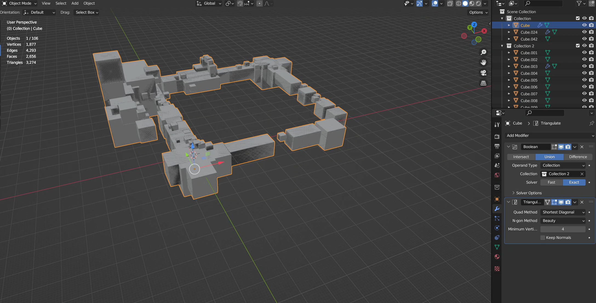
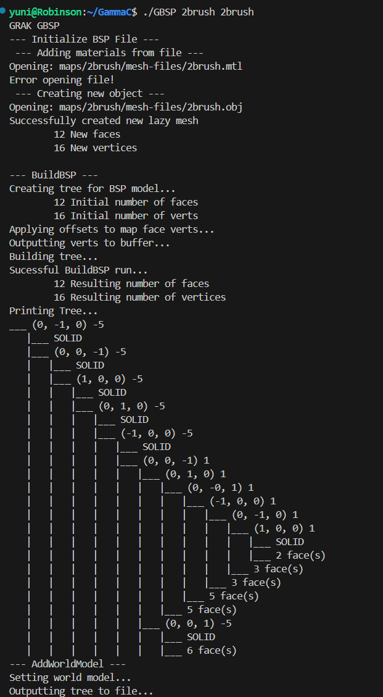
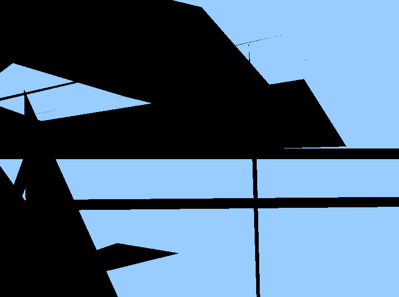

+++
title = "CSCI 5607 FINAL PROJECT" 
description = "The final project for CSCI 5607, where I made the Custom BSP tool(s) for 'GammaC'"
date = 2025-12-14
[extra]
start_date = "1 Nov 2025"
end_date = "12 Dec 2025"
status = "COMPLETE"
+++

<h1 class="article-title">CSCI 5607 FINAL PROJECT</h1>

For my CSCI 5607 final project, I decided to work on the BSP tools to kickstart my project which I called "GammaC". The main idea of the project was to write a binary space partitioning map creation program, as well as a real-time component that at least has rendering capabilities. 

Classic first-person shooter games from the 1990s and early 2000s often utilized three-dimensional binary space partitioning trees to store, and sometimes render, their maps. Such examples included the Quake series, the Counter-Strike games, Half-life, and Half-Life 2.

This project connects with various 3D graphics techniques highlighted in the class. BSP trees are useful data structures which were useful in employing various software rendering techniques such as visibility culling, and frustum culling. Although these techniques are likely considered obsolete, and therefore lesser touched on in the class, they still retain relevance as acceleration structures for real-time collisions. My solid-leaf BSP tree implementation effectively provides a working ground for a chain of development tools. Lighting can be baked into the level file. Entity data can be added into the gamemap. This project can really scale up.

Additionally, this project integrates into a 3D design workflow, where I design my own gamemaps in either Blender or TrenchBroom(a Quake Engine modeling software), and export them as .obj files.

    

        
    

    
        <b>A gamemap I made in blender, which I called "blockout1". This is exported into my program as an .obj file.</b>
    

The .obj files are read into the program, and processed into either an ASCII or binary file containing a BSP tree of all of the geometry. When compiling a map, it has the option to print out a text representation of the solid-leaf tree. 

    

        
    

    
        <b>A small scene compiled with GBSP. The terminal outputs the tree.</b>
    

    

        
    

    
        <b>ASCII representation of the BSP file. Data is stored in lumps referenced by a header. This ascii file can be processed with I/O functions when adding additional utilities to the map creation tool.</b>
    

After getting the functional barebones geometry format, I was extremely excited to debug it. I wrote a quick program to test out the software rendering capabilities by rendering on a per-polygon basis in a back-to-front rendering order. Sure enough, the frustum culling eliminated large chunks of polygon draws.

    

        
    

    
        <b>A test render of "blockout1". It contains ~1-2k triangles total. Only a few hundred are actually drawn in this scene.</b>
    

<h1 class="article-title">GOALS AND DIFFICULTIES</h1>

At this point, I was excited to immediately work on lighting and lightmapping. I brainstormed various ways to potentially implement precomputed-radiance transfers for realtime global illumination. At some point, the professor warned that the time left to complete these ambitious tasks was very little, and that I should at least get a proper OpenGL renderer working. At the time, I thought I did have a working OpenGL renderer working. It outputted a textureless silhouette of the map, so I thought I was on a smooth track to complete my goals of lighting. I wished I payed more heed to the professor's concerns, because I spent so much time working with data representations, that I left myself with no time getting any lighting in my OpenGL renderer.

By the last three days of the project, I was scouring for ways to efficiently render my gamemap. In the end, I learned a terrible lession. The software rendering optimizations leveraged by my map format were completely obsolete in modern OpenGL, and our contemporary era of graphics rendering. I was distraught to find that there weren't even remotely any sensible options to draw on per-polygon bases. I thought that I could at least use something like OpenGL's "immediate mode", which was used in very early 3D games, and was probably considered state-of-the-art in the 1990s. In my mind, I had two options left: represent each polygon with a unique VBO, and sequentially render those, or build off my current method of outputting the entire map model into a single buffer object.

I chose the latter, but was left with little time left. I had to frantically think of how to design my project to represent lighting values, and in the end, I was still stuck with a silhouette... and worse, I messed up my indices, and produced an incomprehensible render!

    

        
    

    
        <b>It's so bugged that I can't even begin to understand what's going on in this render.</b>
    

This was kind of devastating because I blew through another day of work and my next sequential goal of adding Quake-style player movement and collisions relied on a coherent 3D scene. 

<h1 class="article-title">ALL THAT SAID</h1>

All that said, I think I've kicked off a useful starting point for something that can be developed much further. As I mentioned before, this type of project can scale well and integrate into effective game development. Quake was famous for its ease of map creation and for simple and understandable gameplay. While working on this tool, I can definitely see why. The solid-leaf tree neatly organizes a hierarchical collection of game map components. A potentially visible set can be used to organize neighborhoods of data on these trees into linear vectors. 

I really really want to develop this project further on my own time, in order to make an indie game. I also want a basis for making my own games. Even though I wasn't able to exactly create what I wanted, I'm really happy to have kickstarted this longtime goal of mine through this final project. Plus, even though I couldn't create what I wanted, It's not that I can't do in my own time. 

<h1 class="article-title">LIBRARIES USED</h1>
I used Blender and TrenchBroom for 3D modeling. I also used Scratch/JavaScript + WebGL for software rendering. For the C++ renderer, I used OpenGL with SDL.

[Source code repository link](https://github.com/yumagia/GammaC)

{{ gallery() }}