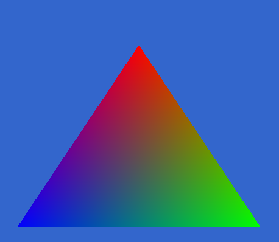
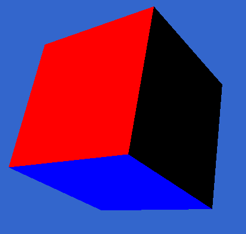
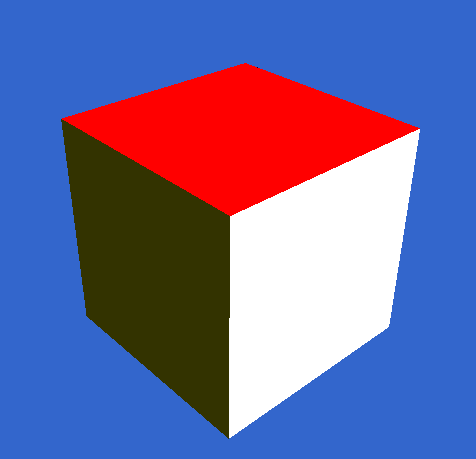
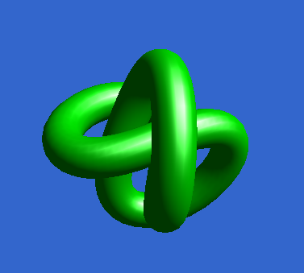
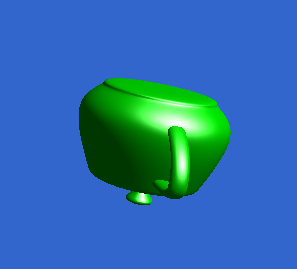

+++
title = "CSCI 5607 HOMEWORK 4" 
description = "The initial assignment for the rasterization unit in CSCI 5607"
date = 2025-11-17
[extra]
start_date = "17 NOV 2025"
end_date = "17 NOV 2025"
status = "COMPLETE"
icon = "/projects/2025-csci5607-homework4/teapot.png"
+++

<h1 class="article-title">CSCI 5607 HOMEWORK 4</h1>

This was the initial assignment for the rasterization unit in CSCI 5607. For the assignment, I have compiled a few OpenGL programs which render various rasterized scenes. They can be seen below.

    

        
    

    
        <b>TriangleColored.cpp</b>
    

    

        
    

    
        <b>Cube3D.cpp</b>
    

    

        
    

    
        <b>CubeLit.cpp</b>
    

    

        
        
    

    
        <b>Knot and teapot files rendered with ModelLoad.cpp</b>
    

{{ gallery() }}