+++
title = "RAYTRACER+" 
description = "A raytracer writen in C++."
date = 2025-11-04
[extra]
start_date = "31 OCT 2025"
end_date = "4 NOV 2025"
status = "COMPLETE"
icon = "/projects/2025-raytracer-plus/plant.png"
+++

<h1 class="article-title">RAYTRACER+</h1>

I previously made [a sphere raytracer](https://yumagia.dev/projects/2025-sphere-raytracer/) that featured things like dielectrics(reflection and refraction), shadows, and phong shading. The next part of the project builds off of this by adding triangles, vertex normals, and acceleration structures.

    

        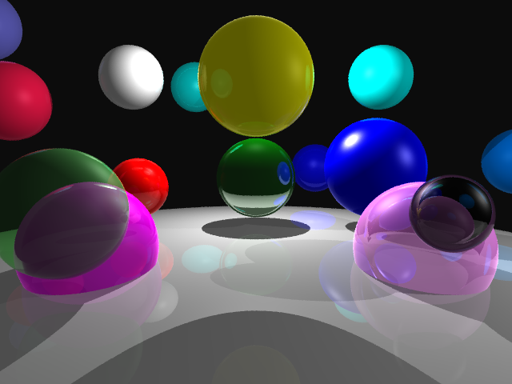
    

    
        <b>This project expands off of the sphere raytracer.</b>
    

Here are some of its features:

    <li>User-specified camera placement, film resolution, and aspect ratio</li>
    <li>User-specified scenes with spheres, triangles, triangles with vertex normals, and background colors</li>
    <li>Arbitrary materials which define diffuse, specular, reflections, and refractions</li>
    <li>Point and directional lights</li>
    <li>Ambient light</li>
    <li>Recursion to a bounded depth</li>
    <li>Jittered supersampling</li>
    <li>A BVH implementation</li>
    <li>Parallelization</li>

<h2>INSTRUCTIONS:</h2>

<b>The project is made to compile on linux, and the provided executable is for linux. 

Just run make to compile the project:

<code>make</code>

It's as simple as that!

To raytrace a scene file, type in the following command:
<code>./Raytracer scenefile</code>
Where "scenefile" is the path to the given file.

You can additionally utilize the BVH by adding the "-accelerate" argument.

<code>./Raytracer scenefile -accelerate</code>

<b><a href="sphere-raytracer.zip">SOURCE ZIP</a></b>

<b><a href="raytracer-executable.zip">PROGRAM EXECUTABLE (Stored in a zip)</a></b>

</b>

<h1 class="article-title">THE BVH</h1>

I must admit. The Stanford dragon was so slow that I genuinely implemented a BVH before it could finish.

I initially wrote it with each node containing a vector of triangles and pointers to its children. Upon seeing [this blog](https://jacco.ompf2.com/2022/04/13/how-to-build-a-bvh-part-1-basics/), and reading through a brief mention of such a struct having issues, I was rather afraid that the BVH was going to cause some problems and a disappointing overhead. Unwieldy structs were also an apparent phenomenon to me in my adventures implementing BSP trees. So I went about, changing all BVH nodes to utilize 

I terminated the program at three hours and started testing the BVH. I was initially very scared because the provided test scene with two triangles was slowed an additional ten seconds from an already concerning 25 seconds it took to render. It felt like an unacceptable overhead. Even after a couple of optimization attempts to further reduce cache misses, it was still much slower. However, to my pleasant surprise, I ran the dragon file for the second time, and it was progressing slowly, but still reasonably.

    

        
    

    
        <b>Disaster struck.</b>
    

This was beyond disappointing. I waited 667.907 seconds for this to happen. I tweaked my BVH code a bit and ran it again. In the meantime, I tried cutting down more unwieldy structs. Maybe the standard vector library was a no-go? I replaced some of those as the dragon approached its completion.

    

        
    

    
        <b>1282.69 seconds later...</b>
    

<h1 class="article-title">ISSUES I SPENT HOURS FIXING</h1>

It all comes crashing down. The BVH was not properly accelerating the scene even when I knew for sure it was implemented properly. The smallest scenes took at least half a minute to load. Although the sphere-only scenes were perfect, any scene with even a single triangle was failing to render properly. Even stranger yet, upon running the scene a few times, some of the renders would look almost accurate, and some would quite look far off. I was perplexed because I didn't expect such non-deterministic behavior to occur with this C++ program with the -fsanitize=adress flag... but there was no time to be perplexed. This project was already a day late. 

    

        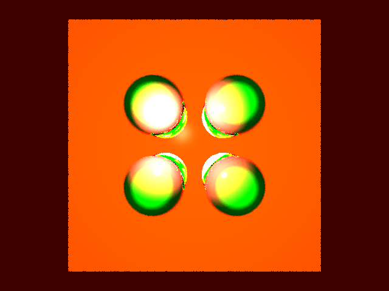
        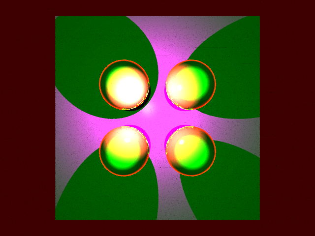
    

    
        <b>Spurious renders of the same executable that would have a possibility of appearing when running the program</b>
    

    

        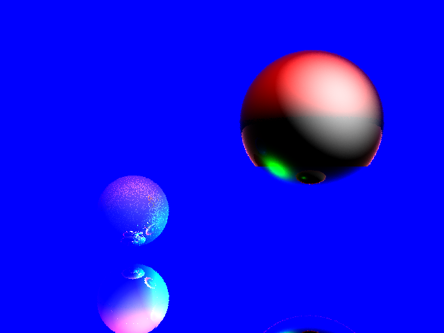
        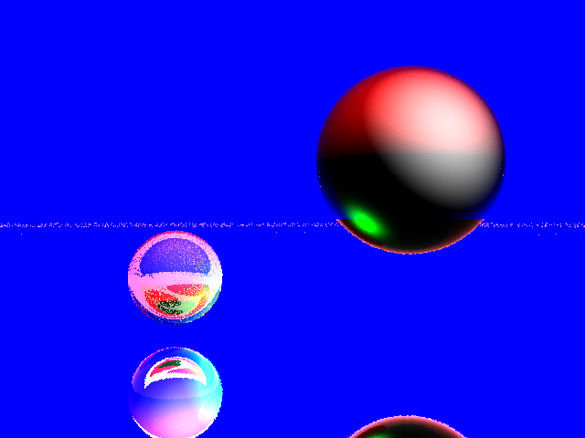
        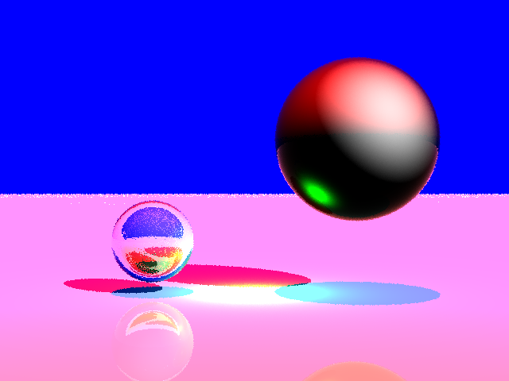
    

    
        <b>The same phenomenon, but on a different file</b>
    

The next morning I woke up and started testing and debugging... and soon enough in the afternoon, it all came together.

<h1 class="article-title">BREAKTHROUGH</h1>

The first major issue I noticed was the fact that I was performing copy assignments on the entire triangle and sphere lists at every ray cast. This is intuitively very bad, and likely explains why the parallel processing was incredibly slow. I removed these operations and ran it again. Immediately, the basic scenes with only a handful of objects ran in a few seconds. They sped up even more when I enabled multithreading.

Strangely, the bug where the output would be different every time the raytracer ran persisted. During class, I was able to hone the issue down to the surface normal returned by a triangle hit. It needed to be flipped towards the origin of the ray such that it would always face in that direction. This code would only sometimes work in certain runtimes. I was perplexed, but I had to go home to eat dinner.

I scoured my code a bit more when it struck me: My plane distances("d" in the general form of the plane) were wrong. I checked the code which created planes for each triangle and sure enough, I didn't even initialize this component. The raytracer was reading off of uninitialized floats the entire time. After fixing that, the scenes looked much closer to how they should have.

    

        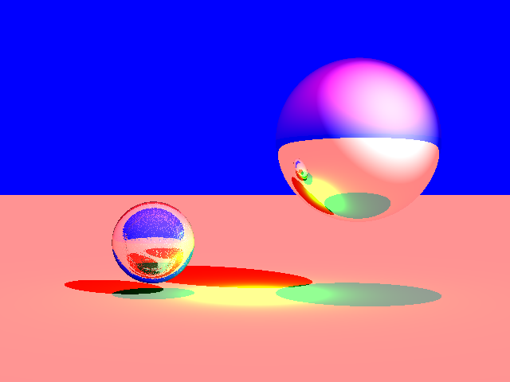
        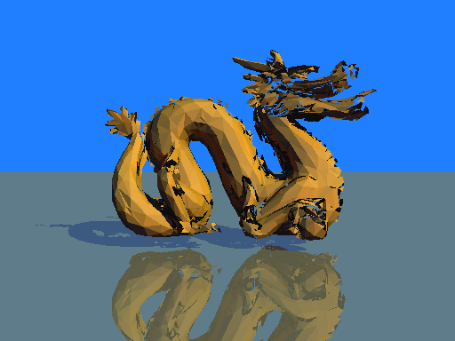
        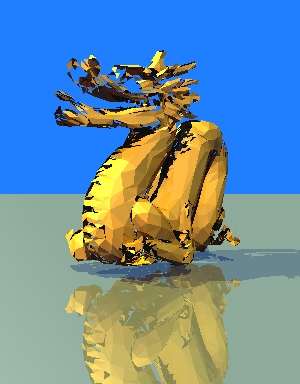
    

    
        <b>The scenes were no longer inconsistent, and they were looking a lot less bugged.</b>
    

After changing a few epsilons, I made a breakthrough! The dragon was rendering properly, and so were the basic triangle-containing scenes.

    

        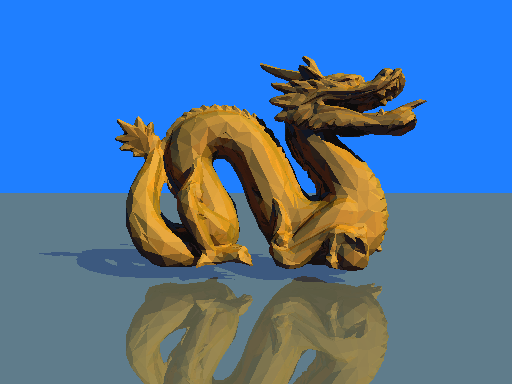
    

    
        <b>Breakthrough!</b>
    

    

        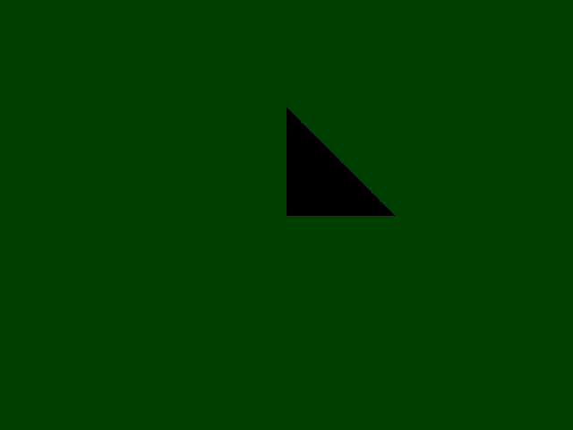
        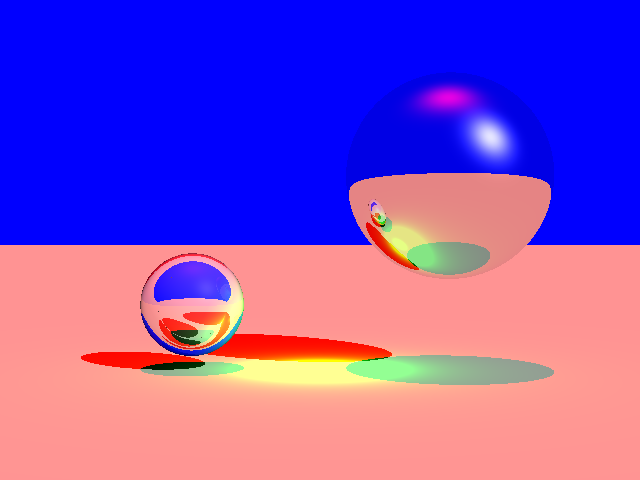
        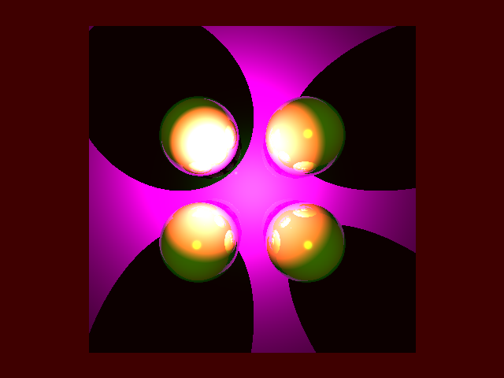
    

    
        <b>The three basic triangle example scenes which now worked.</b>
    

    

        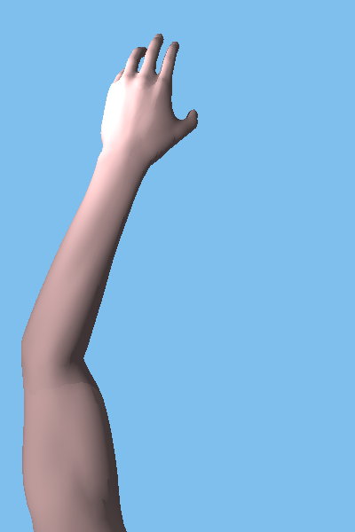
        
        
    

    
        <b>The scenes with triangle normals</b>
    

<h1 class="article-title">OPTIMIZATION</h1>

Previously, the BVH and multithreading were not giving me any performance gains. However, after fixing the aforementioned issues in my code, They were really doing their jobs to reduce render times.

    
        <b>FOO (Two triangles)</b>
    
    

        
    

<table>
    <tr>
        <th> </th>
        <th>No BVH</th>
        <th>BVH</th>
    </tr>
    <tr>
        <th>No Multithreading</th>
        <th>~0.9s</th>
        <th>~0.7s</th>
    </tr>
        <tr>
        <th>12 threads</th>
        <th>~0.2s</th>
        <th>~0.2s</th>
    </tr>
</table>

The two-triangle test scene runs nicely below one second regardless of optimization. It did seem to somehow run faster with BVH but that should really not be the case as there's nothing to accelerate (The BVH cannot further partition a axial face with two triangles). So I'll just chalk that up to variation. It speeds up nicely by around 4-5 times with multithreading.

    
        <b>FOO (Many tesselations)</b>
    
    

        
    

<table>
    <tr>
        <th> </th>
        <th>No BVH</th>
        <th>BVH</th>
    </tr>
    <tr>
        <th>No Multithreading</th>
        <th>~680s</th>
        <th>~230s</th>
    </tr>
        <tr>
        <th>12 threads</th>
        <th>~390s</th>
        <th>~155s</th>
    </tr>
</table>

In the tesellated test scene, there is a clear benefit to the BVH, as it offers many early-outs while testing a tree of triangles. Multithreading helps cut the base time by about half, but the BVH reduced it to a third. With both of those optimizations, the scene ran at 155 seconds, an enourmous improvement from no optimizations, which took 700 seconds.

    
        <b>STANFORD DRAGON</b>
    
    

        
    

<table>
    <tr>
        <th> </th>
        <th>No BVH</th>
        <th>BVH</th>
    </tr>
    <tr>
        <th>No Multithreading</th>
        <th>>1000s</th>
        <th></th>
    </tr>
        <tr>
        <th>12 threads</th>
        <th>~500s</th>
        <th>~300s</th>
    </tr>
</table>

The dragon scene ran longer than 17 minutes without multithreading or the BVH. It sped up to around 500 seconds with multithreading, and I was excited to see some further performance gains with the BVH. However, when I actually looked at the image, the dragon was cut in half. This was saddening, and I didn't really know what happened to the other half.

(I was able to later fix this bug, and the speed remained the same)

    
        <b>PLANT</b>
    
    

        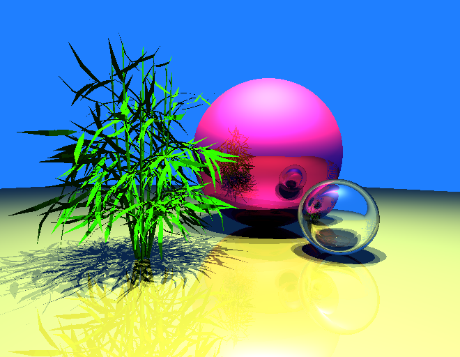
    

<table>
    <tr>
        <th> </th>
        <th>No BVH</th>
        <th>BVH</th>
    </tr>
    <tr>
        <th>No Multithreading</th>
        <th>>1000s</th>
        <th></th>
    </tr>
        <tr>
        <th>12 threads</th>
        <th>~720s</th>
        <th>~520s</th>
    </tr>
</table>

This scene is hefty. Standing at 5k+ triangles, it was slower than my 17 minute timer. Multithreading boosted it to under 1k seconds but not by a massive margin. Even with BVH and 12 threads, I wasn't able to beat 400 seconds. 

<h1 class="article-title">FURTHERMORE</h1>

The whole process of writing triangle support for this raytracer was bug-laden. I immediately got bugs as soon as I could put a triangle on-screen. And I couldn't meaningfully debug them before I wanted to implement the next feature. I was so excited to have a BSP implementation so I could even raytrace quake-like gamemaps, or at least that was my vision. Realistically, I wrote a working BSP algorithm but did not have enough time to integrate it into the project. I wasn't even able to get rid of the last BVH bugs which still cause some of the scenes to not render properly. The amount of time I had to spend rendering and debugging was somewhat frustrating. I really wanted to have my features just work! The slow render times didn't help either. I wished I could make the code cleaner too.

So perhaps I'll revisit this project some day else.

{{ gallery() }}