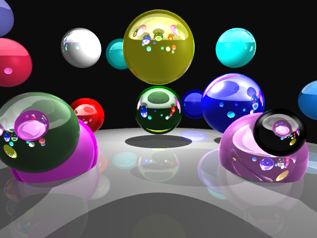

+++
title = "SPHERE RAYTRACER" 
description = "A sphere raytracer writen in C++."
date = 2025-10-24
[extra]
start_date = "22 OCT 2025"
end_date = "24 OCT 2025"
status = "COMPLETE"
icon = "/projects/2025-sphere-raytracer/spheres2.png"
+++

<h1 class="article-title">SPHERE RAYTRACER</h1>

This was a sphere raytracer I wrote in C++. It parses a scene file, which describes primitives in 3D space, as well as attributes for the raytracer, and outputs a raytraced image in various image formats (including BMP and PNG).

Here are some of its features:

    <li>Camera settings (position, direction, image resolution, aspect ratio)</li>
    <li>Background color setting</li>
    <li>BMP, PNG, JPEG(JPG), and TGA formats</li>
    <li>Sphere primitives</li>
    <li>Ambient light setting</li>
    <li>Point and directional lighting</li>
    <li>Shadowing</li>
    <li>Light instancing</li>
    <li>Sampling</li>
    <li>Phong specularity</li>
    <li>Fresnel refraction and reflection</li>

Here is an example file:

#Simple sphere: Scene
camera_pos: -6 2 -4
camera_fwd: -.77 0 -.64
camera_up:  0 1 0
camera_fov_ha: 35
output_image: spheres1.png

#"ground" sphere:
material: .75 .75 .75 .75 .75 .75 .3 .3 .3 32 .2 .2 .2 1.5
sphere: 0 -50 0 50

#red sphere:
material: 1 0 0 1 0 0 .3 .3 .3 32 .2 .2 .2 1.5
sphere: -3 1 0 .75

#green sphere:
material: 0 .7 0 0 .7 0 0 0 0 16 .9 .9 .9 1.1
sphere: 0 1.25 0 1

#blue sphere:
material: 0 0 1 0 0 1 0 0 0 16 0 0 0 1.0
sphere: 3 1.5 0 1.25

#white overhead light
point_light: 10 10 10 0 5 0
ambient_light: .25 .25 .25
background: .05 .05 .05

max_depth: 5

<b><a href="spheres1.txt">(Here is the .txt file)</a></b>

And this is its output:

    

        
    

    
        <b>A sample scene described by the file</b>
    

The scene demonstrates basic instancing of sphere objects, a point light, phong lighting, shadowing, as well as more advanced features like reflections and light transmission, which are dielectric properties specified in each sphere's assigned materials.

Let's look at a more sophisticated scene:

    

        
    

    
        <b>A scene with more spheres of different properties</b>
    

<b><a href="spheres2.txt">(the file)</a></b>

<h1 class="article-title">THE BASICS</h1>

This scene uses a directional light and a custom background. The ambient is the same as the background color. 

    

        
    

    
        <b>They look like cows</b>
    

You can move the camera around:

    

        
        
        
    

    
        <b>At three camera angles</b>
    

Here's what it's like without the background and ambient commands:

    

        
    

    
        <b>I sent them to the moon</b>
    

Raytracing is SLOW. Because of that, there is an option to change the resolution in the scene file.

    

        
        
        
    

    
        <b>At full, half, and quater resolution</b>
    

Additionally, the random sampling makes it slow. However, it's very effective against aliasing. You can see this with side-by-side comparisons between the scene with and without multiple sampling. The aliasing is very noticable when zooming in.

    

        
        
        
        
    

    
        <b>Side-by-side comparisons between multiple-sampling and casting a single ray per pixel</b>
    

<h1 class="article-title">ADVANCED LIGHTING</h1>

We can really see the properties of refraction if we examine these three similar spheres with increasing indices of refraction. The center sphere does not warp the light at all since it has an IR exactly that of the air's

    

        
    

    
        <b>Indices of refraction from left to right: 0.5, 1, 1.5</b>
    

You can also instance many lights. Here is a multiply-lit scene with directional lighting.

    

        
    

    
        <b>A multiply lit sphere</b>
    

When I wrote this raytracer, the fresnel was rather difficult to impleent. I found that I messed up some signs with the vector formulae along the way, which weren't immediately revealed with testing. I also had trouble finding succint information on the implementation of fresnel and snell's law. It was very helpful for me to reference similar renders and to somewhat think, in detail, about the physical phenomena of glass spheres. 

Here's a nice blooper from when I had erroneous refraction:

    

        
    

    
        <b>Some negation somewhere caused the refraction to reflect quite oddly</b>
    

{{ gallery() }}